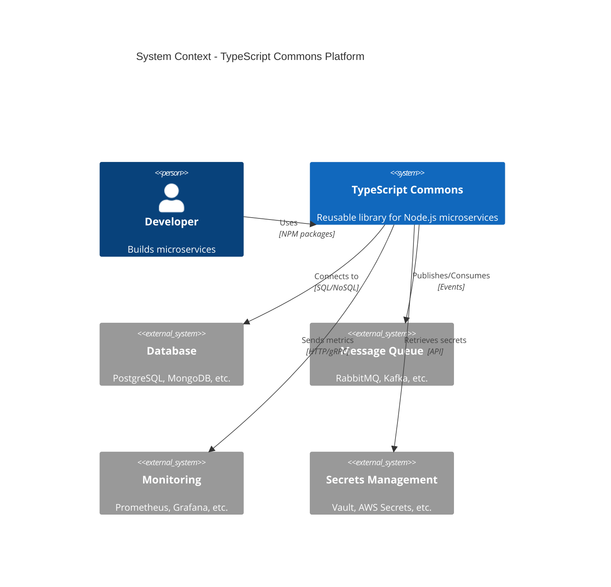
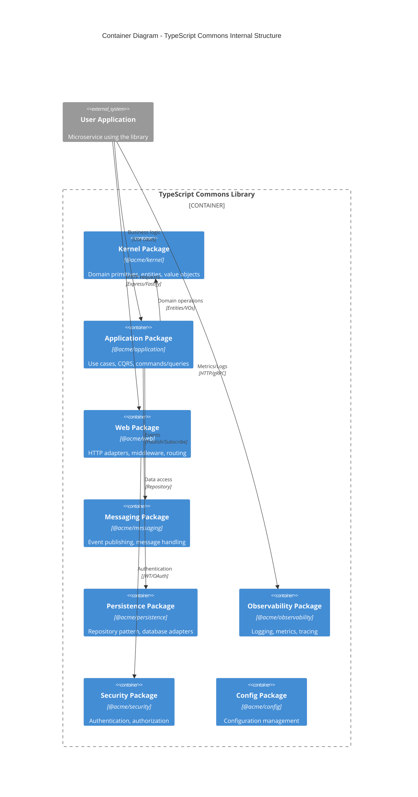
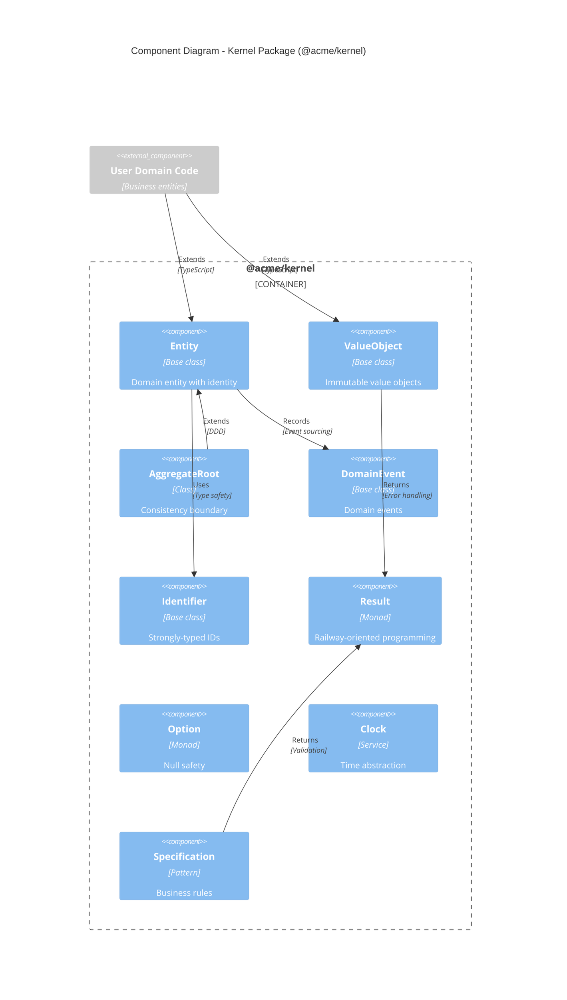

# Architecture Guide

## Clean Architecture Overview

This library implements Clean Architecture principles with Domain-Driven Design (DDD) patterns. The architecture is organized in layers with clear dependency rules.

### Dependency Rule
**Dependencies point inward.** Outer layers depend on inner layers, never the reverse.

```
┌─────────────────────────────────────────────────────────────────┐
│                     Infrastructure Layer                        │
│  Web • Messaging • Persistence • Observability • Security      │
└─────────────────┬───────────────────────────────────────────────┘
                  │ depends on
┌─────────────────▼───────────────────────────────────────────────┐
│                    Application Layer                            │
│     Use Cases • Commands • Queries • Handlers • Ports          │
└─────────────────┬───────────────────────────────────────────────┘
                  │ depends on
┌─────────────────▼───────────────────────────────────────────────┐
│                      Domain Layer                               │
│   Entities • Value Objects • Aggregates • Domain Events        │
└─────────────────────────────────────────────────────────────────┘
```

## C4 Model Diagrams

### Context Diagram (Level 1)


### Container Diagram (Level 2)


### Component Diagram (Level 3) - Kernel Package


## Package Architecture

### Domain Layer (@acme/kernel)

**Purpose**: Contains enterprise business rules and domain logic.
**Dependencies**: None (zero external dependencies)

#### Core Components:

1. **Entity**: Base class for domain entities with identity
   ```typescript
   export abstract class Entity<TId extends Identifier> {
     protected constructor(public readonly id: TId) {}
     
     equals(other: Entity<TId>): boolean {
       return this.id.equals(other.id);
     }
   }
   ```

2. **ValueObject**: Immutable objects defined by their attributes
   ```typescript
   export abstract class ValueObject<T> {
     protected constructor(protected readonly _value: T) {}
     
     get value(): T {
       return this._value;
     }
   }
   ```

3. **AggregateRoot**: Consistency boundary with domain events
   ```typescript
   export abstract class AggregateRoot<TId extends Identifier> extends Entity<TId> {
     private _events: DomainEvent[] = [];
     
     getUncommittedEvents(): readonly DomainEvent[] {
       return this._events;
     }
   }
   ```

#### Key Patterns:

- **Result Pattern**: Railway-oriented programming for error handling
- **Option Pattern**: Null safety without exceptions
- **Specification Pattern**: Composable business rules
- **Domain Events**: Decouple side effects from business logic

---

### Application Layer (@acme/application)

**Purpose**: Orchestrates use cases and coordinates between domain and infrastructure.

#### Core Components:

1. **Command/Query Separation (CQRS)**:
   ```typescript
   export interface Command {
     readonly type: string;
   }
   
   export interface Query<TResult> {
     readonly type: string;
   }
   
   export interface CommandHandler<TCommand extends Command> {
     handle(command: TCommand): Promise<Result<void, ApplicationError>>;
   }
   ```

2. **Use Case Pattern**:
   ```typescript
   export abstract class UseCase<TRequest, TResponse> {
     abstract execute(request: TRequest): Promise<Result<TResponse, ApplicationError>>;
   }
   ```

3. **Repository Ports** (Hexagonal Architecture):
   ```typescript
   export interface Repository<T extends AggregateRoot<any>> {
     save(aggregate: T): Promise<Result<void, RepositoryError>>;
     findById(id: Identifier): Promise<Option<T>>;
   }
   ```

---

### Infrastructure Layer

**Purpose**: Implements ports defined by application layer and provides external integrations.

#### Package Breakdown:

1. **@acme/web**: HTTP adapters (Express, Fastify)
2. **@acme/persistence**: Database adapters (TypeORM, Prisma, MongoDB)
3. **@acme/messaging**: Event publishing (RabbitMQ, Kafka, Redis)
4. **@acme/observability**: Logging, metrics, distributed tracing
5. **@acme/security**: Authentication, authorization, encryption
6. **@acme/config**: Configuration management with validation

---

## Design Patterns

### 1. Hexagonal Architecture (Ports and Adapters)

```typescript
// Port (defined in application layer)
export interface EmailService {
  sendEmail(to: string, subject: string, body: string): Promise<Result<void, EmailError>>;
}

// Adapter (implemented in infrastructure layer)
export class SendgridEmailService implements EmailService {
  async sendEmail(to: string, subject: string, body: string): Promise<Result<void, EmailError>> {
    // Implementation using Sendgrid API
  }
}
```

### 2. Repository Pattern

```typescript
// Abstract repository (application layer)
export abstract class UserRepository {
  abstract findById(id: UserId): Promise<Option<User>>;
  abstract findByEmail(email: Email): Promise<Option<User>>;
  abstract save(user: User): Promise<Result<void, RepositoryError>>;
}

// Concrete implementation (infrastructure layer)
export class PostgresUserRepository extends UserRepository {
  constructor(private database: Database) {
    super();
  }
  
  async findById(id: UserId): Promise<Option<User>> {
    // PostgreSQL implementation
  }
}
```

### 3. Factory Pattern

```typescript
export class DomainServiceFactory {
  constructor(
    private userRepository: UserRepository,
    private eventPublisher: EventPublisher
  ) {}
  
  createUserRegistrationService(): UserRegistrationService {
    return new UserRegistrationService(
      this.userRepository,
      this.eventPublisher
    );
  }
}
```

### 4. Specification Pattern

```typescript
export class UserSpecifications {
  static isActive(): Specification<User> {
    return new Specification(user => user.status === UserStatus.Active);
  }
  
  static hasValidEmail(): Specification<User> {
    return new Specification(user => user.email.isValid());
  }
  
  static canPlaceOrder(): Specification<User> {
    return this.isActive().and(this.hasValidEmail());
  }
}
```

## Testing Architecture

### Layer Testing Strategy:

1. **Domain Layer**: Pure unit tests (no dependencies)
2. **Application Layer**: Unit tests with mocked repositories
3. **Infrastructure Layer**: Integration tests with real adapters

### Test Pyramid:

```
        /\
       /  \      E2E Tests (5%)
      /____\     API tests, full workflows
     /      \
    /        \   Integration Tests (25%)
   /          \  Repository tests, message handlers
  /_Integration_\
 /              \
/   Unit Tests   \  Unit Tests (70%)
\________________/  Domain logic, use cases
```

## Configuration Strategy

### Hierarchical Configuration:
1. **Environment variables** (highest priority)
2. **Configuration files** (config/production.json)
3. **Default values** (lowest priority)

### Type-Safe Configuration:
```typescript
export interface ApplicationConfig {
  readonly database: DatabaseConfig;
  readonly messaging: MessagingConfig;
  readonly security: SecurityConfig;
  readonly observability: ObservabilityConfig;
}

export class ConfigurationBuilder {
  static async build(): Promise<Result<ApplicationConfig, ConfigError>> {
    return ConfigurationLoader
      .fromEnvironment()
      .mergeWith(await ConfigurationLoader.fromFile('config.json'))
      .mergeWith(DefaultConfiguration)
      .validate(ApplicationConfigSchema);
  }
}
```

## Error Handling Strategy

### Error Categories:

1. **Domain Errors**: Business rule violations
2. **Application Errors**: Use case failures  
3. **Infrastructure Errors**: External system failures
4. **System Errors**: Unexpected failures

### Error Flow:
```
Domain Error → Application Error → HTTP Error (Problem Details RFC 7807)
```

## Performance Considerations

### Optimization Strategies:

1. **Lazy Loading**: Load aggregates on-demand
2. **Event Sourcing**: Append-only event store for audit
3. **CQRS**: Separate read/write models for scalability
4. **Caching**: Multi-level caching (memory, Redis, CDN)
5. **Connection Pooling**: Database connection management

### Monitoring:

- **Metrics**: Business KPIs, technical metrics
- **Logging**: Structured logging with correlation IDs
- **Tracing**: Distributed tracing across service boundaries
- **Alerting**: Proactive monitoring with SLO/SLI

## Security Architecture

### Security Layers:

1. **Authentication**: JWT, OAuth 2.0, API keys
2. **Authorization**: Role-based, attribute-based access control
3. **Encryption**: Data at rest and in transit
4. **Input Validation**: XSS, injection prevention
5. **Rate Limiting**: DoS protection
6. **Audit Logging**: Security event tracking

### Secure by Design:

- Input validation at boundaries
- Output encoding for XSS prevention
- SQL injection prevention with parameterized queries
- Secrets management with external vaults
- Principle of least privilege

## Deployment Architecture

### Container Strategy:

```dockerfile
# Multi-stage build
FROM node:20-alpine AS builder
COPY . .
RUN pnpm install --frozen-lockfile
RUN pnpm build

FROM node:20-alpine
COPY --from=builder /app/dist ./dist
COPY --from=builder /app/node_modules ./node_modules
CMD ["node", "dist/main.js"]
```

### Kubernetes Deployment:

- **Horizontal Pod Autoscaling**: Based on CPU/memory metrics
- **Health Checks**: Liveness and readiness probes
- **Service Mesh**: Istio for traffic management
- **Config Management**: ConfigMaps and Secrets
- **Persistent Storage**: StatefulSets for databases

---

## References

- [Clean Architecture - Robert Martin](https://blog.cleancoder.com/uncle-bob/2012/08/13/the-clean-architecture.html)
- [Domain-Driven Design - Eric Evans](https://domainlanguage.com/ddd/)
- [Hexagonal Architecture - Alistair Cockburn](https://alistair.cockburn.us/hexagonal-architecture/)
- [C4 Model - Simon Brown](https://c4model.com/)
- [Microservices Patterns - Chris Richardson](https://microservices.io/)
