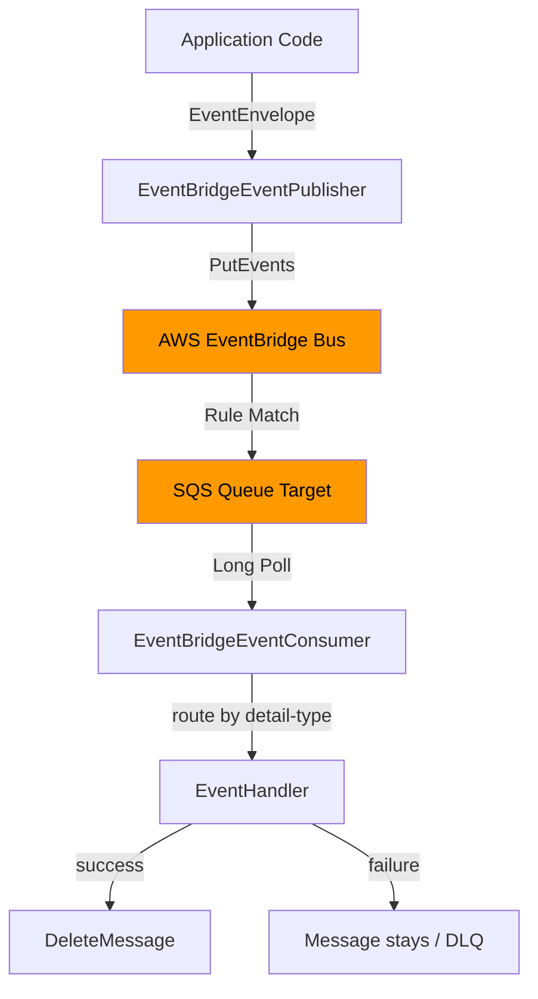

# @acme/messaging-eventbridge

> AWS EventBridge adapter for event-driven messaging with an SQS consumer pattern.

[](.)
[](.)
[](.)
[](.)

## Overview

This package provides a production-ready [EventPublisherPort](../messaging/README.md) implementation for **AWS EventBridge**, along with an SQS-backed consumer that follows the standard EventBridge → SQS target rule pattern.

### Architecture

```
Publisher flow:
Domain Event → EventEnvelope → PutEventsEntry → EventBridge Bus
                                                       │
                                                  [Rule Match]
                                                       │
Consumer flow:             SQSClient ←─── SQS Queue ──┘
EventBridgeEventConsumer ──[poll]──→ processMessage → handlers
```

## Features

- **EventBridgeEventPublisher** — `EventPublisherPort` implementation using `PutEvents`
  - Batch publishing (splits batches > 10 into multiple AWS calls)
  - Failed entry detection (partial-failure handling)
  - Correlation ID & full envelope metadata serialized into `detail`
- **EventBridgeEventConsumer** — SQS long-poll consumer
  - Routes events by `detail-type` to registered handlers
  - At-least-once delivery (message only deleted on success)
  - Deduplication via `eventId` (LRU cap of 10 000)
  - Graceful shutdown via `stop()`
- **EventBridgeConnection** — AWS SDK client lifecycle manager
  - Explicit credential support or AWS credential chain
  - LocalStack-compatible via custom `endpoint`
  - Health monitoring via `DescribeEventBus`
- **TypeScript strict** — `exactOptionalPropertyTypes`, `strictNullChecks`, zero `any`
- **LocalStack compatible** — pass `endpoint: 'http://localhost:4566'` for local dev

## Installation

```bash
pnpm add @acme/messaging-eventbridge
```

AWS SDK peer dependencies are included:

```bash
# Already bundled – no extra install needed
@aws-sdk/client-eventbridge
@aws-sdk/client-sqs
```

## Quick Start

### Publish events

```typescript
import {
  EventBridgeConnection,
  EventBridgeEventPublisher,
} from '@acme/messaging-eventbridge';
import { logger } from '@acme/observability';

// 1. Create and connect
const connection = new EventBridgeConnection(
  {
    region: 'us-east-1',
    eventBusName: 'my-app-bus',
    source: 'com.myapp.orders',
  },
  logger,
);
await connection.connect();

// 2. Publish
const publisher = new EventBridgeEventPublisher(connection, logger);

await publisher.publish({
  eventId: crypto.randomUUID(),
  eventType: 'OrderCreated',
  eventVersion: '1.0',
  timestamp: new Date().toISOString(),
  correlationId: 'corr-abc',
  payload: { orderId: '123', amount: 99.99, currency: 'USD' },
});

// 3. Batch
await publisher.publishBatch([event1, event2, event3]);

// 4. Cleanup
await connection.close();
```

### Consume events (SQS target)

```typescript
import { EventBridgeEventConsumer } from '@acme/messaging-eventbridge';

const consumer = new EventBridgeEventConsumer(
  {
    region: 'us-east-1',
    queueUrl: 'https://sqs.us-east-1.amazonaws.com/123456789/orders-queue',
  },
  logger,
);

// Register handlers
consumer.subscribe('OrderCreated', {
  async handle(envelope) {
    const { orderId } = envelope.payload as { orderId: string };
    await orderService.process(orderId);
    // Message is auto-deleted on success
  },
});

consumer.subscribe('OrderCancelled', orderCancelledHandler);

// Start long-polling
await consumer.start();

// Graceful shutdown
process.on('SIGTERM', async () => {
  await consumer.stop();
});
```

## Configuration Reference

### EventBridgeConfig

| Property | Type | Default | Description |
|---|---|---|---|
| `region` | `string` | **required** | AWS region |
| `source` | `string` | **required** | Event source identifier (e.g. `com.myapp.orders`) |
| `eventBusName` | `string` | `'default'` | Event bus name or ARN |
| `endpoint` | `string` | — | Custom endpoint URL (LocalStack) |
| `accessKeyId` | `string` | — | AWS access key (uses credential chain if omitted) |
| `secretAccessKey` | `string` | — | AWS secret key |
| `sessionToken` | `string` | — | Temp session token |
| `maxBatchSize` | `number` | `10` | Max events per `PutEvents` call (AWS max: 10) |
| `maxRetries` | `number` | `3` | SDK retry attempts on transient errors |

### EventBridgeSQSConsumerConfig

| Property | Type | Default | Description |
|---|---|---|---|
| `region` | `string` | **required** | AWS region |
| `queueUrl` | `string` | **required** | SQS queue URL |
| `endpoint` | `string` | — | Custom endpoint URL (LocalStack) |
| `accessKeyId` | `string` | — | AWS access key |
| `secretAccessKey` | `string` | — | AWS secret key |
| `sessionToken` | `string` | — | Temp session token |
| `maxMessages` | `number` | `10` | Messages per ReceiveMessage call |
| `waitTimeSeconds` | `number` | `20` | Long-poll wait (0–20 seconds) |
| `visibilityTimeout` | `number` | `30` | Seconds message is hidden after receive |
| `pollingIntervalMs` | `number` | `1000` | Poll interval when queue is empty |

## Advanced Usage

### LocalStack (local development)

```typescript
const connection = new EventBridgeConnection(
  {
    region: 'us-east-1',
    eventBusName: 'local-bus',
    source: 'com.myapp',
    endpoint: 'http://localhost:4566',
    accessKeyId: 'test',
    secretAccessKey: 'test',
  },
  logger,
);
```

### Health check

```typescript
const health = await connection.healthCheck();
// {
//   connected: true,
//   region: 'us-east-1',
//   eventBusName: 'my-app-bus',
//   lastError: undefined,
//   publishedCount: 42,
//   errorCount: 0,
// }
```

### NestJS integration

```typescript
@Module({
  providers: [
    {
      provide: EventBridgeConnection,
      useFactory: (logger: Logger) =>
        new EventBridgeConnection(
          { region: 'us-east-1', source: 'com.myapp', eventBusName: 'my-bus' },
          logger,
        ),
      inject: [LOGGER_TOKEN],
    },
    {
      provide: 'EVENT_PUBLISHER',
      useFactory: (conn: EventBridgeConnection, logger: Logger) =>
        new EventBridgeEventPublisher(conn, logger),
      inject: [EventBridgeConnection, LOGGER_TOKEN],
    },
  ],
})
export class MessagingModule implements OnModuleInit {
  constructor(private readonly conn: EventBridgeConnection) {}

  async onModuleInit(): Promise<void> {
    await this.conn.connect();
  }
}
```

### Event pattern matching with cross-account events

In your AWS CDK / Terraform, configure an EventBridge rule to route matching events to your SQS queue:

```typescript
// AWS CDK example
new Rule(this, 'OrdersRule', {
  eventBus: myBus,
  eventPattern: {
    source: ['com.myapp.orders'],
    detailType: ['OrderCreated', 'OrderCancelled'],
  },
  targets: [new SqsQueue(ordersQueue)],
});
```

## Architecture



## EventBridge vs Kafka vs RabbitMQ

| Feature | EventBridge | Kafka | RabbitMQ |
|---|---|---|---|
| Managed service | ✅ Fully managed (AWS) | ❌ Self-managed | ❌ Self-managed |
| Ordering | ❌ No guarantee | ✅ Per partition | ✅ Per queue |
| Retention | ❌ No replay (unless archive) | ✅ Configurable retention | ❌ TTL-based |
| Pattern matching | ✅ Built-in rule engine | ❌ Manual | ❌ Manual |
| Cross-account | ✅ Native support | ❌ Manual | ❌ Manual |
| Consumer model | SQS/Lambda target | Pull (consumer groups) | Push (AMQP) |
| Throughput | ~10k events/s (default) | Millions/s | 50k+/s |
| Latency | ms–100ms | ms | ms |
| Cost | Pay-per-event | Infrastructure | Infrastructure |
| Schema registry | ✅ AWS Schema Registry | ✅ Confluent/Glue | ❌ Manual |
| Use case | Event routing/filtering | High-throughput streaming | Enterprise messaging |

## Best Practices

### Do ✅

```typescript
// Use specific event bus, not 'default' in production
const config = { eventBusName: 'myapp-prod-bus', ... };

// Use conditional optional spread to avoid undefined properties
const envelope = {
  eventId: uuid(),
  eventType: 'OrderCreated',
  eventVersion: '1.0',
  timestamp: new Date().toISOString(),
  payload: myPayload,
  ...(correlationId ? { correlationId } : {}),
};

// Set visibilityTimeout > maximum handler processing time
const consumerConfig = { visibilityTimeout: 120, ... };

// Always await stop() for graceful shutdown
process.on('SIGTERM', () => { void consumer.stop(); });
```

### Don't ❌

```typescript
// Don't use 'default' bus in production
const config = { eventBusName: 'default', ... };

// Don't forget to handle errors in handlers (otherwise message stays visible)
consumer.subscribe('OrderCreated', {
  handle: async (env) => {
    // ❌ Uncaught error = message redelivered (good!) but noisy logs
    await riskyOperation(env.payload);
  },
});

// Don't exceed 10 entries per PutEvents call (handled automatically by publishBatch)
// Don't exceed 256KB per event detail (AWS hard limit)
```

## Troubleshooting

### `AccessDeniedException` on connect

Ensure your IAM role/user has:
- `events:DescribeEventBus` for the target bus
- `events:PutEvents` for publishing

### Messages not appearing in queue

1. Verify the EventBridge rule is enabled
2. Check the rule pattern matches your `source` and `detail-type`
3. Confirm SQS queue has a resource policy allowing EventBridge to send

### Duplicate event processing

The consumer deduplicates by `eventId` (in-memory, up to 10 000 entries). For cross-instance deduplication, combine with `@acme/application`'s idempotency store.

### High memory from deduplication cache

The deduplication set uses an LRU eviction strategy with a cap of 10 000 entries (~a few MB). If your workload processes very high volumes, set a lower `visibilityTimeout` and rely on SQS message deduplication via a FIFO queue instead.

## Testing

Tests use Vitest with full module mocking of AWS SDK:

```bash
pnpm --filter @acme/messaging-eventbridge test
```

For local integration tests with LocalStack:

```bash
# Start LocalStack
docker run --rm -p 4566:4566 localstack/localstack

# Create bus & queue
aws --endpoint-url=http://localhost:4566 events create-event-bus --name test-bus
aws --endpoint-url=http://localhost:4566 sqs create-queue --queue-name test-queue

# Create rule + target
aws --endpoint-url=http://localhost:4566 events put-rule \
  --name test-rule \
  --event-bus-name test-bus \
  --event-pattern '{"source":["com.acme.test"]}'
aws --endpoint-url=http://localhost:4566 events put-targets \
  --rule test-rule \
  --event-bus-name test-bus \
  --targets '[{"Id":"1","Arn":"arn:aws:sqs:us-east-1:000000000000:test-queue"}]'
```
