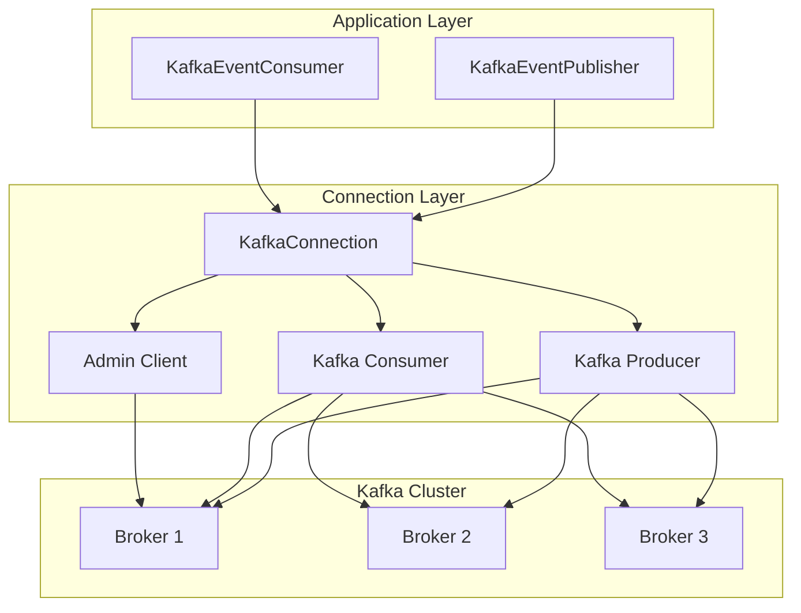

# @acme/messaging-kafka

Apache Kafka adapter for event-driven messaging with consumer groups and exactly-once semantics.

## Features

- **Consumer Groups**: Horizontal scaling with automatic partition rebalancing
- **Idempotent Producer**: At-least-once delivery guarantee by default
- **Transactional Producer**: Optional exactly-once semantics for critical workflows
- **Manual Offset Management**: Explicit control over message acknowledgment
- **Message Deduplication**: Prevent duplicate processing via eventId tracking
- **Partition Key Support**: Message ordering within partitions using eventId
- **Compression**: Built-in gzip compression for efficient network usage
- **Health Monitoring**: Check broker connectivity and producer/consumer status
- **Clean Architecture**: Implements EventPublisherPort and EventConsumer interfaces

## Installation

```bash
pnpm add @acme/messaging-kafka
```

## Quick Start

### 1. Publishing Events

```typescript
import { KafkaConnection, KafkaEventPublisher } from '@acme/messaging-kafka';

// Create connection
const connection = new KafkaConnection({
  brokers: ['localhost:9092'],
  clientId: 'order-service',
}, logger);

await connection.connect();

// Create publisher
const publisher = new KafkaEventPublisher(connection, logger);

// Publish event
await publisher.publish({
  eventId: '123',
  eventType: 'OrderCreated',
  eventVersion: '1.0',
  timestamp: new Date().toISOString(),
  correlationId: 'abc-456',
  payload: {
    orderId: '789',
    customerId: '456',
    total: 99.99
  }
});
```

### 2. Consuming Events

```typescript
import { KafkaConnection, KafkaEventConsumer } from '@acme/messaging-kafka';

// Create connection
const connection = new KafkaConnection({
  brokers: ['localhost:9092'],
  clientId: 'notification-service',
}, logger);

await connection.connect();

// Create consumer
const consumer = new KafkaEventConsumer(connection, logger, {
  groupId: 'notification-service-group',
  topics: ['OrderCreated', 'OrderUpdated'],
});

// Subscribe to events
consumer.subscribe('OrderCreated', {
  handle: async (envelope) => {
    console.log('Order created:', envelope.payload);
    // Process event...
  }
});

// Start consuming
await consumer.start();

// Gracefully shutdown
process.on('SIGTERM', async () => {
  await consumer.stop();
  await connection.close();
});
```

### 3. Transactional Publishing (Exactly-Once)

```typescript
const connection = new KafkaConnection({
  brokers: ['localhost:9092'],
  clientId: 'payment-service',
  transactional: true,
  transactionalId: 'payment-service-tx-1', // Required for transactions
}, logger);

await connection.connect();

const publisher = new KafkaEventPublisher(connection, logger);

// This message will be delivered exactly once
await publisher.publish({
  eventId: 'payment-123',
  eventType: 'PaymentProcessed',
  eventVersion: '1.0',
  timestamp: new Date().toISOString(),
  payload: { amount: 100.00 }
});
```

## Configuration

### KafkaConfig

| Property | Type | Default | Description |
|----------|------|---------|-------------|
| `brokers` | `string[]` | **Required** | List of Kafka broker URLs |
| `clientId` | `string` | `'acme-kafka-client'` | Client ID for the connection |
| `connectionTimeout` | `number` | `30000` | Connection timeout in milliseconds |
| `requestTimeout` | `number` | `30000` | Request timeout in milliseconds |
| `idempotent` | `boolean` | `true` | Enable idempotent producer |
| `maxInFlightRequests` | `number` | `5` | Max in-flight requests per connection |
| `transactional` | `boolean` | `false` | Enable transactional producer |
| `transactionalId` | `string` | `undefined` | Transaction ID (required if transactional=true) |

### KafkaConsumerOptions

| Property | Type | Default | Description |
|----------|------|---------|-------------|
| `groupId` | `string` | **Required** | Consumer group ID |
| `topics` | `string[]` | **Required** | Topics to subscribe to |
| `fromBeginning` | `boolean` | `false` | Start consuming from beginning |
| `autoCommit` | `boolean` | `false` | Auto-commit offsets (manual by default) |
| `sessionTimeout` | `number` | `30000` | Session timeout in milliseconds |
| `heartbeatInterval` | `number` | `3000` | Heartbeat interval in milliseconds |
| `maxBytesPerPartition` | `number` | `1048576` | Max bytes per partition (1MB) |

### KafkaProducerOptions

| Property | Type | Default | Description |
|----------|------|---------|-------------|
| `compression` | `'gzip' \| 'snappy' \| 'lz4' \| 'zstd' \| 'none'` | `'gzip'` | Compression algorithm |
| `acks` | `-1 \| 0 \| 1` | `-1` | Required acknowledgments (-1 = all replicas) |
| `timeout` | `number` | `30000` | Request timeout in milliseconds |

## Advanced Usage

### Batch Publishing

```typescript
const events = [
  {
    eventId: '1',
    eventType: 'UserCreated',
    eventVersion: '1.0',
    timestamp: new Date().toISOString(),
    payload: { userId: '123' }
  },
  {
    eventId: '2',
    eventType: 'UserUpdated',
    eventVersion: '1.0',
    timestamp: new Date().toISOString(),
    payload: { userId: '123', email: 'new@example.com' }
  }
];

await publisher.publishBatch(events);
```

### Health Monitoring

```typescript
const health = await connection.healthCheck();

console.log({
  isHealthy: health.isHealthy, // Overall health
  connectionStatus: health.connectionStatus, // 'connected' | 'disconnected' | 'error'
  connectedBrokers: health.connectedBrokers, // Number of connected brokers
  producerReady: health.producerReady, // Producer connection status
});
```

### Manual Offset Commit

```typescript
const consumer = new KafkaEventConsumer(connection, logger, {
  groupId: 'my-service',
  topics: ['events'],
  autoCommit: false, // Disable auto-commit
});

consumer.subscribe('OrderCreated', {
  handle: async (envelope) => {
    try {
      // Process message
      await processOrder(envelope.payload);
      
      // Offset is automatically committed after successful processing
    } catch (error) {
      // On error, offset is NOT committed - message will be redelivered
      throw error;
    }
  }
});
```

### Message Ordering

Messages with the same partition key (eventId by default) are guaranteed to be ordered:

```typescript
// These messages will be processed in order for the same userId
await publisher.publish({
  eventId: 'evt-1',
  eventType: 'UserCreated',
  // ... eventId 'evt-1' determines partition
});

await publisher.publish({
  eventId: 'evt-1', // Same key = same partition = ordered
  eventType: 'UserUpdated',
  // ...
});
```

## Architecture



## Clean Architecture Compliance

This adapter follows Clean Architecture principles:

1. **Dependency Inversion**: Implements `EventPublisherPort` and `EventConsumer` interfaces from `@acme/messaging`
2. **Framework Independence**: Application layer is decoupled from Kafka specifics
3. **Testability**: Easy to mock and test without real Kafka
4. **Business Logic Isolation**: Domain logic stays in domain layer

## Comparison: Kafka vs RabbitMQ

| Feature | Kafka | RabbitMQ |
|---------|-------|----------|
| **Message Model** | Log-based (append-only) | Queue-based |
| **Ordering** | ✅ Per-partition ordering | ❌ No global ordering |
| **Persistence** | ✅ Durable by default | ⚠️ Optional |
| **Throughput** | 🚀 Very high (millions/sec) | ⚠️ Moderate (thousands/sec) |
| **Latency** | ⚠️ Higher (milliseconds) | ✅ Lower (microseconds) |
| **Consumer Pattern** | Pull-based | Push-based |
| **Replay** | ✅ Full replay support | ❌ No replay |
| **Message Retention** | ✅ Time/size-based | ❌ Deleted on consumption |
| **Consumer Groups** | ✅ Built-in | ❌ Manual implementation |
| **Exactly-Once** | ✅ Transactional | ❌ Not supported |
| **Dead Letter Queue** | ⚠️ Manual setup | ✅ Built-in |
| **Use Case** | Event streaming, analytics | Task queues, RPC |
| **Best For** | High-volume event sourcing | Low-latency request/reply |

## Best Practices

### ✅ DO

- Use consumer groups for horizontal scaling
- Enable manual offset commit for at-least-once delivery
- Set meaningful `groupId` (e.g., `service-name-feature`)
- Monitor partition lag regularly
- Use transactional producer for critical operations
- Implement idempotent message handlers
- Set partition count based on expected throughput

### ❌ DON'T

- Don't auto-commit offsets before processing completes
- Don't use same `groupId` for different logical consumers
- Don't create too many partitions (overhead increases)
- Don't forget to handle rebalancing gracefully
- Don't skip error handling in message handlers
- Don't use Kafka for request/reply patterns (use RabbitMQ instead)

## Troubleshooting

### Connection Issues

```typescript
// Check health
const health = await connection.healthCheck();
if (!health.isHealthy) {
  console.error('Kafka unhealthy:', health.lastError);
}

// Verify brokers are reachable
const admin = connection.getAdmin();
const cluster = await admin.describeCluster();
console.log('Connected brokers:', cluster.brokers.length);
```

### Consumer Lag

```typescript
// Monitor lag via admin API
const admin = connection.getAdmin();
const groups = await admin.describeGroups(['my-group-id']);
console.log('Group state:', groups[0].state);
```

### Slow Processing

- Increase partition count for more parallelism
- Scale consumer instances (up to partition count)
- Optimize message handler performance
- Consider batch processing

## Testing

```typescript
import { describe, it, expect, vi } from 'vitest';
import { KafkaEventPublisher } from '@acme/messaging-kafka';

describe('KafkaEventPublisher', () => {
  it('should publish event', async () => {
    const mockConnection = {
      getProducer: vi.fn().mockReturnValue({
        send: vi.fn().mockResolvedValue([]),
      }),
      getConfig: vi.fn().mockReturnValue({ transactional: false }),
    };

    const publisher = new KafkaEventPublisher(mockConnection, logger);

    await publisher.publish({
      eventId: '123',
      eventType: 'TestEvent',
      eventVersion: '1.0',
      timestamp: new Date().toISOString(),
      payload: { test: true },
    });

    expect(mockConnection.getProducer().send).toHaveBeenCalled();
  });
});
```

## License

MIT
