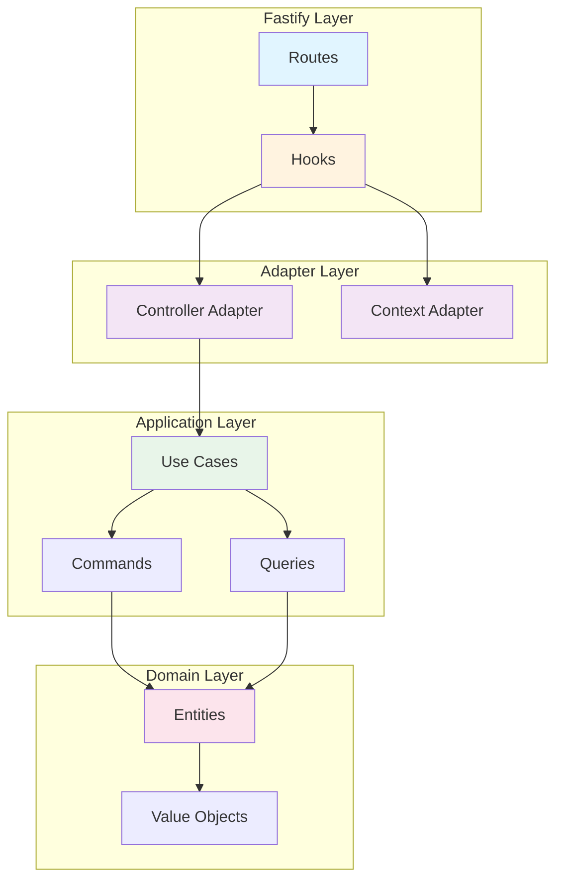

# @acme/web-fastify

Fastify adapter for ts-commons platform following Clean Architecture and hexagonal architecture principles.

## Features

- 🚀 **High Performance**: Built on Fastify, the fastest Node.js web framework
- 🔄 **Correlation Tracking**: Automatic correlation ID generation and propagation
- 🛡️ **Error Handling**: RFC 7807 Problem Details format
- 📊 **Structured Logging**: HTTP request/response logging with duration tracking
- 🎯 **Use Case Adapters**: Clean integration between Fastify and application layer
- 🔍 **Context Extraction**: Multi-tenant support, user context, and JWT parsing
- ✅ **Type Safe**: Full TypeScript support with strict mode
- 🧪 **Well Tested**: 11 passing integration tests

## Installation

```bash
pnpm add @acme/web-fastify
```

## Quick Start

```typescript
import Fastify from 'fastify';
import {
  correlationHook,
  errorHandlerHook,
  loggingHook,
  FastifyControllerAdapter,
  FastifyContextAdapter,
} from '@acme/web-fastify';

const app = Fastify();

// Register hooks
app.addHook('onRequest', correlationHook());
app.addHook('onRequest', loggingHook(logger));
app.addHook('onRequest', FastifyContextAdapter.contextHook());
app.setErrorHandler(errorHandlerHook(logger));

// Adapt use cases to routes
app.post('/users', FastifyControllerAdapter.adaptCreate(createUserUseCase));
app.get('/users/:id', FastifyControllerAdapter.adaptQuery(getUserUseCase));
app.put('/users/:id', FastifyControllerAdapter.adaptCommand(updateUserUseCase));
app.delete('/users/:id', FastifyControllerAdapter.adaptDelete(deleteUserUseCase));

await app.listen({ port: 3000 });
```

## API Reference

### Hooks

#### `correlationHook(headerName?)`

Generates or extracts correlation IDs for request tracing.

**Parameters:**
- `headerName` (optional): HTTP header name for correlation ID. Default: `'x-correlation-id'`

**Example:**
```typescript
app.addHook('onRequest', correlationHook('x-request-id'));
```

#### `errorHandlerHook(logger)`

Converts errors to RFC 7807 Problem Details format.

**Supported Error Types:**
- `ValidationError` → 400 Bad Request
- `DomainError` → 422 Unprocessable Entity
- 404 errors → 404 Not Found
- Others → 500 Internal Server Error

**Example:**
```typescript
app.setErrorHandler(errorHandlerHook(logger));
```

#### `loggingHook(logger, options?)`

Logs HTTP requests and responses with structured data.

**Options:**
- `logLevel`: Log level ('debug' | 'info' | 'warn'). Default: `'info'`
- `logRequestBody`: Whether to log request body. Default: `false`
- `excludePaths`: Array of paths to exclude from logging. Default: `['/health', '/metrics']`

**Example:**
```typescript
app.addHook('onRequest', loggingHook(logger, {
  logLevel: 'debug',
  logRequestBody: true,
  excludePaths: ['/health'],
}));
```

### Adapters

#### `FastifyControllerAdapter`

Adapts use cases to Fastify route handlers with automatic Result type handling.

**Methods:**

##### `adapt(useCase)`
Generic adapter for any use case. Returns 200 OK on success.

```typescript
app.get('/users', FastifyControllerAdapter.adapt(listUsersUseCase));
```

##### `adaptCommand(useCase)`
For command use cases (mutations). Returns 200 OK on success.

```typescript
app.put('/users/:id', FastifyControllerAdapter.adaptCommand(updateUserUseCase));
```

##### `adaptQuery(useCase)`
For query use cases (read-only). Returns 200 OK with data.

```typescript
app.get('/users/:id', FastifyControllerAdapter.adaptQuery(getUserUseCase));
```

##### `adaptCreate(useCase)`
For creation commands. Returns 201 Created on success.

```typescript
app.post('/users', FastifyControllerAdapter.adaptCreate(createUserUseCase));
```

##### `adaptDelete(useCase)`
For deletion commands. Returns 204 No Content on success.

```typescript
app.delete('/users/:id', FastifyControllerAdapter.adaptDelete(deleteUserUseCase));
```

#### `FastifyContextAdapter`

Extracts context information from Fastify requests.

**Methods:**

##### `fromRequest(request)`
Extracts complete context from request.

```typescript
const context = FastifyContextAdapter.fromRequest(request);
console.log(context.correlationId);
console.log(context.tenantId);
console.log(context.user);
```

##### `extractTenantId(request)`
Extracts tenant ID from `x-tenant-id` header.

```typescript
const tenantId = FastifyContextAdapter.extractTenantId(request);
```

##### `extractUserContext(request)`
Extracts user context from JWT or session.

```typescript
const user = FastifyContextAdapter.extractUserContext(request);
```

##### `contextHook()`
Creates a hook that adds context to request.

```typescript
app.addHook('onRequest', FastifyContextAdapter.contextHook());

// Access in route handler
app.get('/users', async (request) => {
  const { correlationId, tenantId, user } = request.useCaseContext;
  // ...
});
```

## Architecture



## Complete Example

```typescript
import Fastify from 'fastify';
import {
  correlationHook,
  errorHandlerHook,
  loggingHook,
  FastifyControllerAdapter,
  FastifyContextAdapter,
} from '@acme/web-fastify';
import { Logger } from '@acme/observability';
import { Result } from '@acme/kernel';
import type { UseCase } from '@acme/application';

// Create logger
const logger = new Logger('user-service');

// Define use case
class GetUserUseCase implements UseCase<{ id: string }, User, Error> {
  async execute(input: { id: string }): Promise<Result<User, Error>> {
    // Your business logic here
    const user = await userRepository.findById(input.id);
    
    if (!user) {
      return Result.err(new Error('User not found'));
    }
    
    return Result.ok(user);
  }
}

const getUserUseCase = new GetUserUseCase();

// Create Fastify app
const app = Fastify({
  logger: false, // Use our custom logger
});

// Register hooks in order
app.addHook('onRequest', correlationHook());
app.addHook('onRequest', loggingHook(logger, { logLevel: 'info' }));
app.addHook('onRequest', FastifyContextAdapter.contextHook());

// Register error handler
app.setErrorHandler(errorHandlerHook(logger));

// Register routes
app.get('/users/:id', FastifyControllerAdapter.adaptQuery(getUserUseCase));

// Start server
await app.listen({ port: 3000, host: '0.0.0.0' });
logger.info('Server started on port 3000');
```

## Testing

```typescript
import { describe, it, expect, beforeAll, afterAll } from 'vitest';
import Fastify, { FastifyInstance } from 'fastify';
import { correlationHook, errorHandlerHook } from '@acme/web-fastify';

describe('My API', () => {
  let app: FastifyInstance;

  beforeAll(async () => {
    app = Fastify();
    app.addHook('onRequest', correlationHook());
    app.setErrorHandler(errorHandlerHook(logger));
    
    // Register routes
    app.get('/users/:id', getUserHandler);
    
    await app.ready();
  });

  afterAll(async () => {
    await app.close();
  });

  it('should get user', async () => {
    const response = await app.inject({
      method: 'GET',
      url: '/users/123',
    });

    expect(response.statusCode).toBe(200);
    const body = JSON.parse(response.body);
    expect(body.id).toBe('123');
  });
});
```

## Best Practices

### 1. Hook Registration Order

Register hooks in this order for optimal behavior:

```typescript
app.addHook('onRequest', correlationHook());
app.addHook('onRequest', loggingHook(logger));
app.addHook('onRequest', FastifyContextAdapter.contextHook());
app.setErrorHandler(errorHandlerHook(logger));
```

### 2. Error Handling

Always throw errors from use cases - the error handler will convert them:

```typescript
class MyUseCase implements UseCase<Input, Output, Error> {
  async execute(input: Input): Promise<Result<Output, Error>> {
    if (!input.valid) {
      return Result.err(new ValidationError('Invalid input'));
    }
    // ...
  }
}
```

### 3. Context Access

Use the context hook to access context in route handlers:

```typescript
app.addHook('onRequest', FastifyContextAdapter.contextHook());

app.get('/users', async (request) => {
  const { tenantId, user } = request.useCaseContext;
  // Use context in your logic
});
```

### 4. Async/Await

Fastify has excellent async/await support. Use it:

```typescript
app.get('/users/:id', async (request, reply) => {
  const result = await useCase.execute({ id: request.params.id });
  return result.unwrap();
});
```

## Performance Tips

1. **Schema Validation**: Use Fastify's built-in schema validation for better performance
2. **Serialization**: Define response schemas to enable fast JSON serialization
3. **Async Hooks**: Use async hooks (functions returning Promise) for better performance
4. **Connection Pooling**: Configure proper connection pooling for databases

## Differences from Express Adapter

| Feature | Express | Fastify |
|---------|---------|---------|
| **Hooks** | Middleware functions | Hook system (onRequest, preHandler, etc.) |
| **Performance** | Good | Excellent (2x faster) |
| **Schema Validation** | Manual | Built-in JSON Schema |
| **Async/Await** | Supported | Native and optimized |
| **Plugin System** | None | First-class plugin system |
| **Type Safety** | Good | Excellent |

## License

MIT

## Related Packages

- `@acme/web-express` - Express.js adapter
- `@acme/web` - Core web abstractions
- `@acme/application` - Use cases and CQRS
- `@acme/kernel` - Domain primitives
- `@acme/observability` - Logging and tracing
